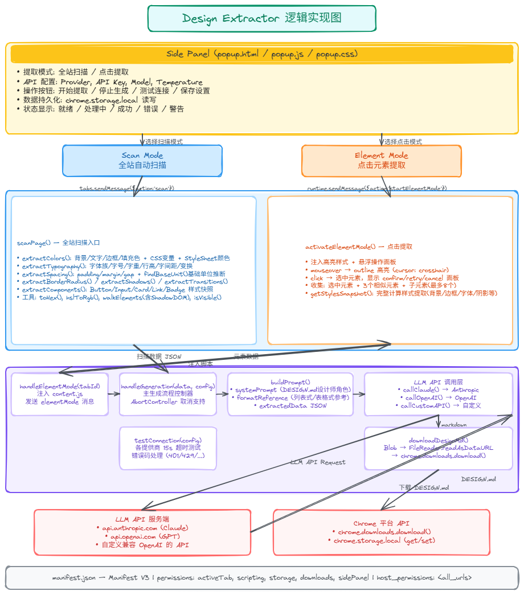

<div align="center">

<h1>Design Extractor</h1>

<p>一款 Chrome 浏览器扩展，可从任意网页提取视觉设计系统，并通过 LLM 生成 <code>DESIGN.md</code> 设计文档。</p>

<p>
  <a href="README.md">English</a> | <b>中文</b>
</p>


</div>

---

## 概述

**Design Extractor** 是一款 Chrome 侧边栏扩展，能够自动分析网页的视觉设计元素——包括颜色、字体、间距、阴影、圆角和组件样式——并通过 LLM API 生成专业的 `DESIGN.md` 设计系统文档。

生成的 `DESIGN.md` 遵循 [Google Stitch](https://stitch.withgoogle.com/) 单文件设计系统格式，作为设计意图与 AI 生成代码之间的桥梁。

## 工作原理



## 功能特性

- **全站扫描模式**：自动采样页面可见 DOM 元素，按频率聚合设计 Token。
- **点击提取模式**：在页面中点击任意元素，提取其计算样式及相邻同类元素。
- **LLM 驱动生成**：支持 Anthropic Claude、OpenAI GPT 及自定义 API 端点。
- **一键下载**：生成的 `DESIGN.md` 直接通过浏览器下载。
- **深色 UI**：侧边栏界面灵感源自 Figma / Adobe Creative Cloud 等设计软件。

## 安装方法

1. 克隆或下载本仓库。
2. 打开 Chrome，访问 `chrome://extensions/`。
3. 开启右上角的**开发者模式**。
4. 点击**加载已解压的扩展程序**，选择本项目文件夹。
5. 点击工具栏中的扩展图标，打开侧边栏。

## 使用说明

1. 打开任意普通网页（不支持 `chrome://`、`file://` 等特殊页面）。
2. 点击扩展图标打开侧边栏。
3. 在 **API 配置** 区域配置 LLM API：
   - 选择提供商：Anthropic Claude / OpenAI GPT / 自定义 API
   - 填入 API Key
   - （可选）调整模型名称和 Temperature
4. 选择提取模式：
   - **全站扫描** — 扫描整个页面
   - **点击提取** — 点击页面中的特定元素
5. 点击 **开始提取**，等待 LLM 生成并自动下载 `DESIGN.md`。

## 技术栈

- Chrome Extension Manifest V3
- Side Panel API
- Content Script 注入 (`scripting` API)
- Service Worker 后台脚本
- 原生 JavaScript（无需构建步骤）

## 文件结构

```
├── manifest.json       # 扩展清单
├── popup.html          # 侧边栏 UI
├── popup.css           # 深色主题样式
├── popup.js            # 界面交互逻辑
├── content.js          # DOM 提取引擎
├── background.js       # LLM API 调用与文件下载
├── icons/              # 扩展图标
├── README.md           # 英文版本
├── README.zh-CN.md     # 本文件
└── LICENSE             # MIT 许可证
```

---

<div align="center">

Made with 💜 for designers and developers.

</div>
